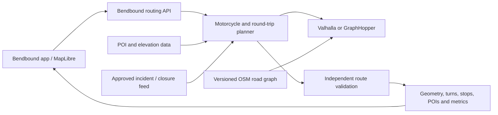

# Bendbound routing engine: plan and options

Planning only. No routing code, hosting, data imports or provider changes are
included in this proposal. The starting assumption is an online UK beta, followed
by Europe if route quality and operating costs are acceptable.

## Recommendation

Build a Bendbound routing service around a self-hosted open-source road engine.
Own the motorcycle preferences, loop search, validation, POI matching and API.
Retain MapLibre and the existing map design.

Use Valhalla as the initial baseline because the app already consumes its routes
and it has motorcycle costing. Before committing to a substantial fork, compare
it with GraphHopper on the same UK routes. GraphHopper's custom models and
round-trip implementation may reduce the work needed for winding rides. Neither
engine's default configuration implements all of Bendbound's strict rules.

## Options

| Option | What we would own | Advantages | Main limitations | Assessment |
|---|---|---|---|---|
| Backend coordinating existing public/commercial APIs | One app endpoint, candidate selection, caching and validation | Smallest initial change; moves retries off the phone | Provider limits, repeated external requests, limited road-level controls | Useful transition, insufficient for full control |
| Self-host Valhalla plus Bendbound planner | Data builds, motorcycle costs, loop generation, road exclusions, route validation | Existing integration; motorcycle costing and navigation output | Custom curvature scoring and strict loop search still required; C++ changes may be needed | Preferred baseline |
| Self-host GraphHopper plus Bendbound planner | Custom profiles, loop constraints, data and service | Custom models expose curvature, road class, surface, urban density and turn penalties | Must validate/extend motorcycle access handling; default round-trip avoidance is a penalty, not a ban | Strong alternative to benchmark |
| Entirely new road engine | OSM import, graph storage, snapping, search, restrictions, directions, updates and planner | Maximum control | Largest development and maintenance burden; recreates mature infrastructure | Defer unless existing engines demonstrably block essential requirements |

Valhalla describes its motorcycle model as beta and exposes motorway/trail
preferences; those preferences are not a dedicated winding-road optimiser.
[Valhalla route API](https://valhalla.github.io/valhalla/api/route/api-reference/).
GraphHopper documents curvature and other road attributes in its
[custom models](https://github.com/graphhopper/graphhopper/blob/master/docs/core/custom-models.md).
Its current [round-trip implementation](https://github.com/graphhopper/graphhopper/blob/master/core/src/main/java/com/graphhopper/routing/RoundTripRouting.java)
uses a repeated-edge penalty of five, so it can still reuse roads.

BRouter is another configurable, elevation-aware engine, but its stated emphasis
is bicycle/energy-based car routing and Java/Android offline use. It would need a
separate motorcycle and iOS assessment, so I would not add it to the first pilot.
[BRouter repository](https://github.com/abrensch/brouter).

## Requirements and how we would implement them

| App requirement | Proposed engine/service behaviour |
|---|---|
| Round-trip distance within less than 10 km of the target | Search for candidates close to the requested distance, then accept only if absolute distance error is strictly below 10 km. Measure road geometry, not waypoint spacing. Rank smaller errors higher. |
| Never use the same road twice in a round trip | Identify physical road sections in the graph, associate both travel directions with the same section, exclude already used sections during loop construction, and independently validate the completed loop. Road names are not identities. |
| Fast / winding / twisty | Rank valid routes using measured curvature, time/detour, road class, surface and junction burden. Keep winding-road preference independent of willingness to use trails or unpaved roads. |
| Avoid motorways | Treat the enabled switch as an actual restriction, validate the result, and return no match if necessary. A small motorway preference is not a strict ban. |
| Chosen direction | Distinguish the initial departure heading from the region in which most of the loop should lie. Use both in scoring; do not promise a compass-perfect departure where streets make it impossible. |
| Multiple standard-trip stops without an arbitrary UI cap | Keep the supplied order, calculate connected legs internally, preserve turn restrictions and snapping across boundaries, then return one route. Very large trips become cancellable jobs rather than silently truncating the stop list. |
| Lettered stops and numbered POIs | Return stable stop IDs and exact distances/positions along the final route. The app retains A, B, C labels and numbered cards. Nearby POIs are highlights; a selected must-visit POI becomes an explicit stop. |
| Route-following arrows and navigation | Return one authoritative geometry with manoeuvres tied to positions along it. Arrows, headings, progress, stops and POIs use that same geometry. |
| Rerouting during a ride | Use the current position, direction and remaining stops. Retain the original ride's used-road history if strict round-trip non-repetition applies; explain when a valid continuation cannot be found. |
| Incidents and closures | Add a separate feed adapter that matches an incident to a road and direction, with expiry and confidence. Closures affect route validity; delays affect time/selection; icons remain styled by Bendbound. |

“No repeated roads” applies to round trips, as requested. Standard trips may need
backtracking to visit the chosen stops. For loops, revisiting a junction does not
necessarily reuse a road. At a start position partway along an edge, split that
edge at the start so the two different halves are not incorrectly counted as a
repeat. Account for ramps, bridges, parallel roads and divided carriageways in
the definition and test cases.

There is a physical limit: a ride starting in a cul-de-sac cannot return to the
same point without reusing its only exit. A graph bridge can create the same
problem. Keep the user's strict rule and report that no matching loop was found;
never add an unannounced overlap allowance. Distinguish a proven connectivity
problem from a search that simply exhausted its time budget.

## Proposed architecture

The phone submits the requirements once. The server can perform several internal
searches over its local road graph, reuse intermediate results and return the
best valid candidate. This removes repeated external routing calls from the
phone; it does not mean that a constrained loop can always be calculated with
one shortest-path search.

Start with diversified candidate loops and iterative improvement. Track used
road sections during construction, check that a return path remains available,
and retain multiple candidates so an attractive outward leg does not trap the
return journey. Distance-to-home lower bounds can prune candidates that cannot
fit the remaining distance budget. Cap the search time and allow cancellation.
Use positive route costs; rewarding curves must not make repeated cycling around
the same roads artificially profitable.

Maintain an independent final validator. It checks the distance tolerance,
physical-road reuse, connectivity, stop order, vehicle access and configured
exclusions before any result is labelled valid. Keep the full route internally;
map simplification must not alter these checks or lose stop/manoeuvre references.

## Delivery sequence and decision gates

1. **Agree the definitions and build a benchmark.** Start with 50–100 fixtures:
   urban starts, rural loops, coasts, mountains, cul-de-sacs, bridges, one-way
   systems, nearby parallel roads, 40–400 km loops, and standard trips with many
   stops. Record the current app's results as a baseline. Include cases that must
   fail, not only attractive success examples.
2. **Run a regional engine comparison.** Import the same UK OSM snapshot into
   pinned Valhalla and GraphHopper releases. Compare motorcycle access, turn
   instructions, curvature quality, stop continuity, latency, memory, import time
   and the work required for strict edge exclusions. Verify that desired features
   exist in the pinned release, not just the latest development branch.
3. **Build standard-trip service behaviour first.** One endpoint, ordered stops,
   coherent snapping, configured exclusions, directions and a stable response
   format. Keep the app's map renderer and route presentation unchanged.
4. **Add Bendbound's loop planner and validator.** Implement the distance and
   no-repeat rules as hard acceptance conditions. Tune fast/winding/twisty
   preferences using road geometry and rider-reviewed examples. A valid result
   rate is meaningful only when measured over cases where a compliant loop exists.
5. **Add POIs and ride continuation.** Match POIs to the final route; support
   explicitly selected stops; add rerouting against the remaining itinerary and
   previously ridden road sections. Integrate live feeds only after access and
   usage terms are confirmed.
6. **Pilot and operate it.** Run behind a feature flag alongside the current
   planner. Use versioned graph builds, staged updates with rollback, request
   cancellation, load tests, rate limits and monitoring. Log route-quality metrics
   while limiting retention of precise rider coordinates. Expand geography after
   the UK pilot meets the agreed quality and operating budget.

Proposed acceptance gates: every returned strict loop passes the independent
distance/repetition checks; standard trips retain every requested stop; no route
breaks the configured motorway rule; and the rider panel can distinguish winding
from fast routes for appropriate test areas. Benchmark response-time targets
before committing to an SLA. GraphHopper explicitly documents a speed/flexibility
trade-off between its routing modes, so request-specific exclusions need performance
testing rather than assumptions about precomputed shortest-path speed.
[GraphHopper routing modes](https://github.com/graphhopper/graphhopper/blob/master/docs/core/routing.md).

## Effort, operating costs and boundaries

For one experienced backend/routing engineer, my rough planning estimate is
1–2 weeks for definitions and the engine comparison, another 4–8 weeks for a UK
prototype with strict validation, and a further 4–8 weeks for a dependable pilot.
These are estimates, not delivery commitments; data quality and loop feasibility
may dominate. A completely new engine should be treated as a many-month programme
with ongoing specialist maintenance.

Self-hosting replaces per-call provider dependence with servers, graph-build
resources, storage, monitoring and maintenance. Size a small deployment from the
regional benchmark before quoting hosting costs. Global coverage, high concurrent
usage, traffic feeds and offline-on-phone routing are separate cost increases.
OSM-derived data and engine licensing/attribution must be reviewed before release.

Owning the road engine does not provide Waze data. Waze's incident feed is offered
through partner arrangements and includes only data approved for sharing. Design
the incident adapter so another approved feed can be used without replacing the
engine or map. [Waze Data Feed specifications](https://support.google.com/waze/partners/answer/13458165?hl=en).

Offline routing on the phone should be a later project: it adds regional downloads,
storage/version management, mobile engine integration and offline rerouting tests.
The initial server plan can deliver the requested route-planning options while
the existing app independently handles GPS recording and the map's visual design.

Calimoto's public repositories do not supply their winding-route engine. See the
[separate review](calimoto-routing-review.md) for what was available and what can
inform our design.
